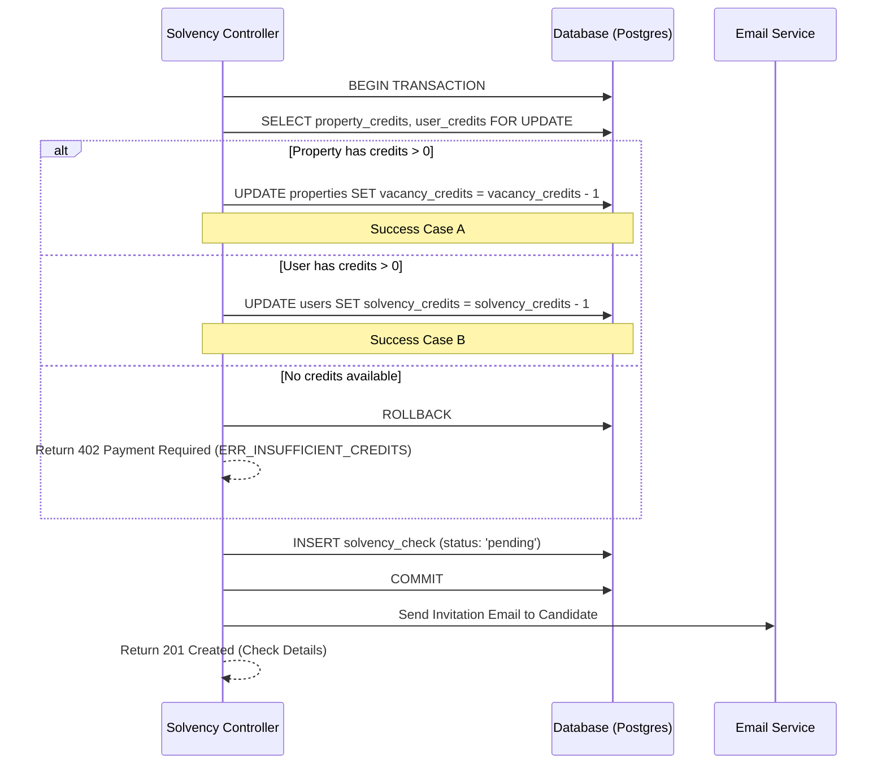

# Backend Spec: Hybrid Credit Consumption (Solvency Check)

This document outlines the robust implementation of the hybrid credit system where consumption priority is given to **Property-specific credits** over **Global User credits**.

## 1. Architectural Decision
The credit validation and consumption logic should be **atomic** and integrated directly into the `POST /api/v1/solvency/check` endpoint. 

> [!IMPORTANT]
> **Why not a separate endpoint?**  
> A separate `check-balance` endpoint would introduce a "Time-of-Check to Time-of-Use" (TOCTOU) race condition. An internal atomic transaction ensures that if the check starts, the credit is guaranteed and consumed.

## 2. Process Flow (Atomic Transaction)



## 3. Implementation Details

### A. Error Responses
When no credits are available, the API must return a specific error structure to allow the frontend to trigger the correct UI (e.g., the shake animation and specific message).

**Response (402 Payment Required):**
```json
{
  "error": "ERR_INSUFFICIENT_CREDITS",
  "message": "Solde insuffisant. Veuillez recharger votre compte ou votre logement.",
  "details": {
    "global_balance": 0,
    "property_balance": 0
  }
}
```

### B. Database Atomicity
To prevent double-spending of credits in high-concurrency environments, use standard SQL locking:

```sql
-- PostgreSQL Example inside a Transaction
SELECT solvency_credits FROM users WHERE id = 'user_id' FOR UPDATE;
SELECT vacancy_credits FROM properties WHERE id = 'prop_id' FOR UPDATE;
```

### C. Logic Priority (Pseudo-code)
```go
func ConsumeCredit(userID, propertyID string) error {
    prop := db.FindProperty(propertyID)
    if prop.VacancyCredits > 0 {
        return prop.DecrementCredit()
    }
    
    user := db.FindUser(userID)
    if user.SolvencyCredits > 0 {
        return user.DecrementCredit()
    }
    
    return errors.New("ERR_INSUFFICIENT_CREDITS")
}
```

## 4. Recommendations for Testing
- **Concurrency Test**: Simulate two simultaneous requests for a user with only 1 credit remaining. Ensure only one check is created.
- **Priority Test**: Verify that if a property has credits, the user's global balance remains unchanged after a check.
- **Rollback Test**: Ensure that if the email sending fails (or any subsequent step), the credit is "refunded" (or the transaction is rolled back before commit).
